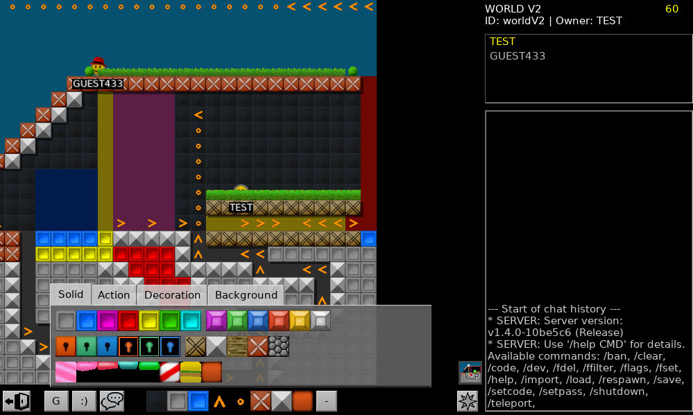

# OpenEdits

A 2D game block building inspired by Everybody Edits.
Code structure inspired by Minetest practices.

The project direction can be found in [doc/DIRECTION.md](doc/DIRECTION.md).

## Gameplay

**Hotkeys**

 * W/A/S/D or arrow keys: move player
 * Space: Jump
 * LMB: Place the selected block
 * RMB or Shift+LMB: Block eraser
 * RMB + Ctrl: Select clicked block including params
 * Mouse scroll: Zoom in/out
     * Warning: Rendering performs pretty badly. Do not scroll out too far.
 * 1-9: Hotbar block selector
     * Use RMB to drag & drop a block from the selector into the hotbar
 * `/` or T or Enter: Open chat box
     * Enter: Submit
     * ESC: Cancel and close
     * Tab: Nickname autocompletion
     * Up/Down: Previous chat message / empty chat message
 * E: Toggle block selector
 * G: Toggle god mode
 * M: Toggle minimap
 * F1: Toggle debug information

**Chat commands**

 * See `/help`

Permission/player flag examples:

 * `/fset FOOBAR tmp-edit-draw` temporary edit access (until rejoin)
 * `/fset FOOBAR godmode` persistent god mode access (after the world is saved)
 * `/fdel FOOBAR owner` removes all persistent access except for "banned"
 * `/ffilter` lists all players with any specified flags

**Command line arguments**

 * `--version` outputs the current game version
 * `--unittest` runs the included tests to sanity check
 * `--server` starts a server-only instance without GUI
 * `--setrole USERNAME ROLE`
     * `ROLE` can be one of: `normal`, `moderator`, `admin`.
     * Can be executed while a server is already running.
 * `--go USERNAME PASSWORD(FILE) [WORLD_ID]`
     * Starts a local server and joins the world ID (if provided)

**Environment variables**

 * `OE_DEBUG=+foo,-bar,+all` override the default log levels
     * `+` prefix: verbose logging
     * `-` prefix: ignore anything below error level
     * `all`: Changes *all* loggers
     * Specific log level overrides take priority over `all`.

**World import/export**

 * `*.eelvl` files in `worlds/imports/` are listed by the server as playable read-only worlds
     * Helpful level archive: <https://archive.offlinee.com/>
 * Clients may use `.export FILENAME` to export the current world to `worlds/exports/`
 * See `worlds/README.txt` for further information

## [Downloads](https://github.com/SmallJoker/OpenEdits/releases)
<!-- ^ I'm not a smelly nerd -->

### Linux

1. Extract the archive to any location
2. Run `AppRun.sh`
3. In case of issues: run with `gdb`. Debug symbols are included.

### Windows

1. Extract the archive to any location
2. Run the executable
3. In case of issues: use a debugger such as x64dbg

## Compiling

### Dependencies

 * CMake (cmake-gui recommended for desktops)
 * [Irrlicht-Mt](https://github.com/SmallJoker/irrlicht-mt) : GUI/rendering library
 * [enet](http://enet.bespin.org/) : networking library
 * LuaJIT or Lua 5.1 : (WIP) server-defined scripts
 * SQLite3 : auth & world saving
 * Threads (pthread?)
 * zlib: world compression (including EELVL import/export)
 * [OpenAL-soft](https://github.com/kcat/openal-soft): sound (for GUI builds only)

Dependency tree:

	OpenEdits
	├── enet
	├── irrlicht-mt (server)
	├── irrlicht-mt (client)
	│   ├── libjpeg
	│   ├── libpng
	│   │   └── zlib
	│   └── zlib
	├── openal-soft (client, optional)
	└── sqlite3
	└── zlib

Debian/Ubuntu:

	sudo apt install libenet-dev libopenal-dev libsqlite3-dev zlib1g-dev

Windows:

* C99 standard library is required. msvcrt uses C89, thus MinGW or Clang are recommended over MSVC.

Project compiling:

	cmake -S . -B build
	cd build
	make -j

**Headless server compiling**

1. Install the minimal required libraries
2. Put the IrrlichtMt headers (include directory) somewhere
3. `cmake -S . -B build -DBUILD_CLIENT=0 -DIRRLICHTMT_BUILD_DIR="/path/to/irrlicht/include/"`
4. `cd build` -> build `make -j` -> start `./OpenEdits-server`

**Distributing** (simplified)

	cd build
	make install
	bash ../misc/pack.sh

## Licenses

Code: [LGPL 2.1](LICENSE.txt)+

**Imported code**

 * [minimp3](https://github.com/lieff/minimp3) (CC 0), used in GUI builds only
 * [SHA3IUF](https://github.com/brainhub/SHA3IUF) (MIT)
 * [FindENet.cmake](https://www.orxonox.net/browser/code/trunk/cmake/tools) (GPL 2)
 * [FindLuaJIT.cmake](https://github.com/minetest/minetest/tree/master/cmake/Modules) (LGPL 2.1+)

### Fonts

DejaVu Sans bitmaps (Bitstream Vera license, extended MIT)

 * Converted with https://github.com/kahrl/irrtum

### Images

Images that are not listed below were created by SmallJoker (CC BY 4.0).

DailyYouth (CC BY 3.0)

 * [`icon_chat.png`](https://www.iconfinder.com/icons/3643728/balloon_chat_conversation_speak_word_icon)

IconMarket (CC BY 3.0)

 * [`icon_minimap.png`](https://www.iconfinder.com/icons/6442794/compass_direction_discover_location_navigation_icon) (desaturated)

ZUMMACO (CC BY 3.0)

 * [`ìcon_leave.png`](https://www.iconfinder.com/icons/7030313/sign_out_ui_basic_logout_app_user_interface_ui_icon)

### Sounds

Sounds that are not listed below were created by SmallJoker (CC BY 4.0).

Piotr Barcz (CC 0)

 * [`piano_c4.mp3`](https://freepats.zenvoid.org/Piano/honky-tonk-piano.html)
